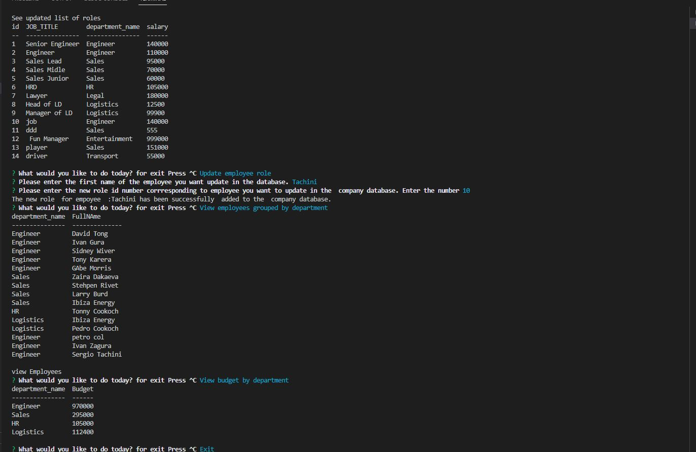

  # Epmloyee Tracker
  

      
  
  ## Table-of-Contents
  * [Description](#description)
  * [Installation](#installation)
  * [Usage](#usage)
  * [License](#License)
  * [Contributing](#Contributors)
  * [Tests](#tests)
  * [Questions](#questions)
  * [Video](#Video)
    
  ## Description
  This web application was developed to run an employee tracking system.

  ## Installation
  nnpm i mysql2

  npm i inquirer

  npm i console.table

  npm init
   

  ## Usage
  Employee Tracker helps to maintain records of employees, departments, salaries and provides possibility of getting varios data slices
 Run 'node server.js' to start app
  ## Screenshot 
  
   ## License
  This application is covered  under the mit license.
  
  license details:  [mit](https://choosealicense.com/licenses/mit)
    

  ## Contributors
  Classmates

  ## Video
  https://youtu.be/BWhlkdw3Pak
  ## Tests
  no test
  ## Questions
  Please contact me using the following links:
  [GitHub](https://github.com/felixbor)   

  [Email: ](mailto:felixbor@gmail.com)
  
